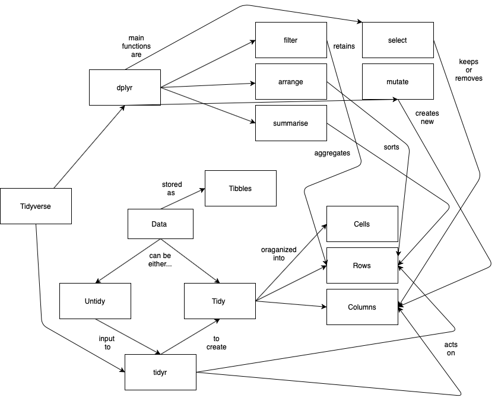

# RStudio Instructor Certification Teaching Exam

📺 [View Sample Lesson
Slides](https://friendly-wozniak-ba74a8.netlify.app/#1)

## Learner Persona

Brooks is a researcher in a cancer wet lab. He has worked extensively
with Excel but is new to programming in R. His research involves
managing data from multiple different platforms and he needs to be able
to examine his data to spot potential issues, such as batch effects, and
calculate basic statistics. He believes R will be the best way to manage
his data in a reproducible manner. He is currently working in a lab
while also studying for school, so he needs to be able get up and
started working with R quickly. He also needs to work in a flexible
environment that works with his school and research schedule.

## Concept Map

