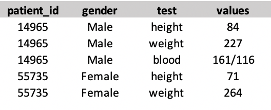
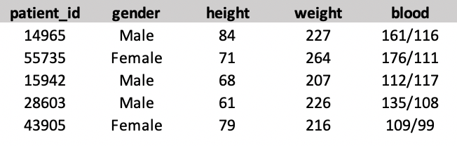
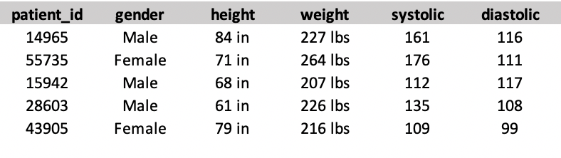

```{r xaringan-themer, include = FALSE}
library(xaringanthemer)
duo_accent(primary_color = "#02b4ba", 
           secondary_color = "#005a75",
           code_highlight_color = "rgba(207, 244, 252,0.5)",)
```


```{r setup, include=FALSE}
knitr::opts_chunk$set(
  fig.width = 10, 
  fig.height = 6, 
  fig.retina = 2,
  warning = FALSE, 
  message = FALSE
)
xaringanExtra::use_xaringan_extra(c("animate_css", "text_poster", "panelset"))
xaringanExtra::use_tachyons()

library(tidyverse)
library(readxl)

patient_vitals <- read_excel("data/patient-vitals.xlsx", sheet = "Sheet2")

```

class: center middle hide-count hide-logo

<div class="talk-logo"></div>

.talk-meta[
  .talk-title[# The Life-Changing Magic of Tidying Up<br> .smaller[Data cleaning using tidyr and dplyr]]

  .talk-author[Jordan Creed]
  
  .talk-date[ @jhcreed]
]

???

---

## Patient lab data  

.pull-left[
Theoretical example based on common lab data.

`r ncol(patient_vitals)` columns and `r nrow(patient_vitals)` rows:

1. `patient_id` : 5 digit number unique to each patient
2. `test` : name of lab measurement 
  + `height`, `weight` and `blood`
3. `value` : value of the lab measurement
  + inches, pounds, and systolic/diastolic

]

.pull-right[

```{r untidy-data-example}
patient_vitals
```

]

---

## What is "tidy" data? 

.pull-left[
Data comes in all shapes and sizes, but not all data organization is made equal!

3 elements of tidy data:

1. Each .accent-blue[variable] has its own .accent-blue[column]
2. Each .accent-blue[observation] has its own .accent-blue[row]
3. Each .accent-blue[value] has it own .accent-blue[cell]

.blank[blank line]

`r emo::ji("point_right")` For more information please see chapter 11 of [R for Data Science](https://r4ds.had.co.nz/data-import.html)
]

.pull-right.h-center[

]

---

## What would "tidy" lab data look like? 

.pull-left[
A)



B) 


]

.pull-right[
C)


D) 


]

---

## What would "tidy" lab data look like? 

.pull-left[
A)


B) 


]

.pull-right[

.accent-blue[C)]


D) 


]

---

## `tidyr` actions 

`pivot_longer()` and `pivot_wider()` reshape data 
* `pivot_wider(patient_vitals, id_cols = patient_id,names_from = test, values_from = value)`

`separate()`, `extract()` and `unite()` split and combine character columns
* `separate(patient_vitals, value, into = c("value_systolic", "diastolic"), sep = "/")`

`drop_na()`, `complete()`, `fill()`, and `replace_na()` format missing values
* `drop_na(pateint_vitals)`

---

## `dplyr` verbs and syntax

`select()` subset columns
* `select(patient_vitals, patient_id, test)`

`filter()` subset rows
* `filter(patient_vitals, test == "height")`

`mutate()` create new variables/columns
* `mutate(patient_vitals, log_value = log(value))`

`summarise()` aggregates rows
* `summarise(patient_vitals, avg_value = mean(value, na.rm = TRUE))`

`arrange()` orders rows 
* `arrange(patient_vitals, patient_id)`

.blank[blank line]

Operations can be chained together with the pipe operator (`%>%`) 

---

class: center middle

.dramatic[
Lets do it 
in R!
]


```{css, echo=FALSE}
.talk-logo {
  width: 288px;
  height: 334px;
  position: absolute;
  top: 5%;
  left: 35%;
  background-image: url('figures/dplyr-logo.png');
  background-size: cover;
  background-repeat: no-repeat;
}
.talk-meta {
  #font-family: Overpass;
  position: absolute;
  text-align: left;
  bottom: 10px;
  left: 25px;
}
.talk-author {
  color: #444;
  font-weight: bold;
  font-size: 1.5em;
  line-height: 1em;
}
.talk-date {
  color: #666;
  font-size: 1.25em;
  line-height: 0;
}
.hide-count .remark-slide-number {
  display: none;
}
# sizing 
.w-50 {
  width: 50%;
}
.w-75 {
  width: 75%;
}
.w-150 {
  width: 150%;
}
.h-center {
  margin: 0 auto;
}
.top-0    { top:    0; }
.right-0  { right:  0; }
.bottom-0 { bottom: 0; }
.left-0   { left:   0; }

# colors
.accent-other { 
  color: light brilliant orange,
}
.accent-purple { 
  color: #b668f7 ; 
}
.accent-blue { 
  color: #005a75 ;
}
.accent-orange{
  color: #f9850a ;
}
.blank { 
  color: white ;
}
.dramatic p {
  font-size: 145px;
  color: #005a75 ;
  margin-top: 0;
  margin-bottom: 0;
}
```
